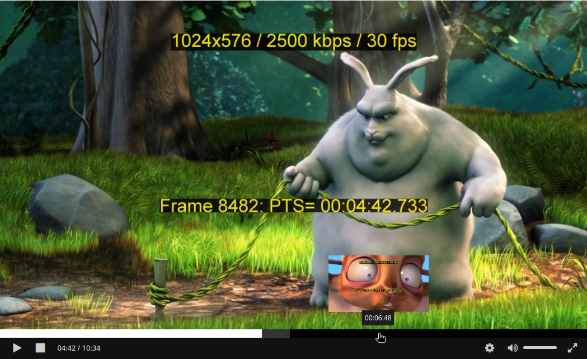

# renderThumbnail

## Description

Method allowing to render DASH thumbnails corresponding to a specific position:

 _You can see in that screenshot a content being played with a
thumbnail acting as a seeking preview on top of a mouse pointer (the thumbnail show a part
of the content with a squirrel on screen)._

## Overview and simple case

To render a thumbnail, an application can call this method providing an object with at
least two properties:

- `container` (`HTMLElement`): The DOM element in which the thumbnail will be set. This
  can be any type element, the RxPlayer will then append an inner element containing
  thumbnail data inside.

- `time` (`number`): The position, in seconds, for which you want a thumbnail to be
  rendered.

`renderThumbnail` will then return a Promise that will resolve once the corresponding is
both loaded and rendered or reject if any of those operations either failed or were
cancelled (the error can be inspected to know which case we encountered, more information
below):

```js
rxPlayer
  .renderThumbnail({
    container: containerElement,
    time: 104,
  })
  .then(() => {
    console.log("The thumbnail is now displayed");
  });
```

This method tries to run in an optimal way:

- If multiple calls are done to `renderThumbnail` with the same `container` before any of
  those call finished, only the last call will be taken into account, the previous ones
  will be cancelled.

- When asking to render the same thumbnails multiple time in a row, the resource will be
  cached so only one request will be performed.

## Error cases

A `renderThumbnail` can fail due to multiple reasons:

- There is no thumbnail at the asked timestamp

- The thumbnail failed to load

- The thumbnail failed to render

- Another call to `renderThumbnail` with the same `container` element was performed since

To allow you to detect which case was encountered, the `renderThumbnail` method will
return an `Error` object when rejecting. On that `Error`, a code property will be defined,
that may be set to a string which will be either:

- `ABORTED`: the thumbnail-loading task was aborted before it has ended. The most probable
  is that a new call to `renderThumbnail` with the same `container` element has been
  performed since then.

- `NO_THUMBNAIL`: the given `time` does not seem to be linked to thumbnails.

- `NOT_FOUND`: the given `time` could have been linked to a thumbnail but no thumbnail was
  found for it once resources were loaded.

- `LOADING`: the thumbnail failed to load.

- `RENDERING`: the thumbnail could be loaded, but failed to render.

- `NONE`: Other uncategorized errors.

For example, we can write the following code:

```js
rxPlayer
  .renderThumbnail({
    container: containerElement,
    time: 104,
  })
  .then(
    () => {
      console.log("The thumbnail is now displayed");
    },
    (error) => {
      switch (error.code) {
        case "ABORTED":
          console.log("The thumbnail request was aborted.");
          break;
        case "NO_THUMBNAIL":
          console.log("There is no thumbnail at the asked time.");
          break;
        case "NOT_FOUND":
          console.log("No thumbnail found at the asked time.");
          break;
        case "LOADING":
          console.log("Failed to load the thumbnail.");
          break;
        case "RENDERING":
          console.log("Failed to render the thumbnail.");
          break;
        case "NONE":
          console.log("Other unrecognized error");
          break;
      }
    },
  );
```

## Behavior of the previous thumbnail on error

Let's say you call `renderThumbnail` on a `container` that already contains a thumbnail
(from a previous `renderThumbnail` call).

When that new thumbnail will be loaded - and only then, it will replace the one that was
already there in `container`. But what should happen with that thumbnail that is already
there if the new `renderThumbnail` call fails - due to e.g. no thumbnail being at the
wanted `time` or due to the thumbnail request failing?

The default behavior is that, for any reason other than `ABORTED` (see errors), the
`container` element will be cleared of all thumbnails that were already there (for
`ABORTED`, `container` is not changed and will still contain the previous thumbnail).

We've thought that this was what was wanted from most applications: If we succeed to load
a new thumbnail, we replace the previous one, if we fail, the previous one is still
removed but is replaced by nothing.

But for cases where you want to keep the previous thumbnail displayed on an error, we
added an optional `keepPreviousThumbnailOnError` boolean property. By setting it to
`true`, the previous thumbnail will keep being rendered in `container` if a new call to
`renderThumbnail` fails:

```js
rxPlayer.renderThumbnail({
  keepPreviousThumbnailOnError: true,
  container: containerElement,
  time: 104,
});
```

## Having several thumbnail tracks

DASH contents may present several thumbnail tracks, each for example having thumbnails of
different resolutions.

To let you decide which thumbnail track you want to load thumbnails from, we let you
signal the wanted thumbnail track's through an optional `thumbnailTrackId` property:

```js
rxPlayer.renderThumbnail({
  thumbnailTrackId,
  container: containerElement,
  time: 104,
});
```

In turn, you can know the thumbnail tracks' id by listing them through the
[`getAvailableThumbnailTracks` method](./getAvailableThumbnailTracks.md)

## Syntax

```js
player.renderThumbnail({
  container,
  time,
  keepPreviousThumbnailOnError,
  thumbnailTrackId,
});
```

- **arguments**:

  1.  _thumbnailInfo_ `Object`: Information on the thumbnail you wan to load. This object
      can contain the following properties:

      - _container_ `HTMLElement`: Mandatory. HTMLElement inside which the thumbnail
        should be displayed.

        The resulting thumbnail will fill that container if the thumbnail loading and
        rendering operations succeeds. If there was already a thumbnail rendering request
        on that container, the previous operation is cancelled.

      - _time_ `number`: Mandtory. Position, in seconds, for which you want to provide an
        image thumbnail.

      - _keepPreviousThumbnailOnError_ `boolean|undefined`: Optional.

        If set to `true`, we'll keep the potential previous thumbnail found inside the
        container if the current `renderThumbnail` call fail on an error. We'll still
        replace it if the new `renderThumbnail` call succeeds (with the new thumbnail).

        If set to `false`, to `undefined`, or not set, the previous thumbnail potentially
        found inside the container will also be removed if the new new `renderThumbnail`
        call fails.

        The default behavior (equivalent to `false`) is generally more expected, as you
        usually don't want to provide an unrelated preview thumbnail for a completely
        different time and prefer to display no thumbnail at all.

      - _thumbnailTrackId_ (`string|undefined`): Optional.

        If set, specify from which thumbnail track you want to display the thumbnail from.
        That identifier can be obtained from the `getThumbnailMetadata` call (the `id`
        property).

## Examples

```js
// showing the thumbnail for the second `52` inside `containerElement`
rxPlayer.renderThumbnail({
  container: containerElement,
  time: 52,
});

// Same thing but with a specific thumbnail track id.
rxPlayer.renderThumbnail({
  container: containerElement,
  time: 52,
  thumbnailTrackId: "id1",
});

// Same thing but with the alternative behavior of keeping the previous
// thumbnail if the new operation fails.
rxPlayer.renderThumbnail({
  container: containerElement,
  time: 52,
  thumbnailTrackId: "id1",
  keepPreviousThumbnailOnError: true,
});
```
